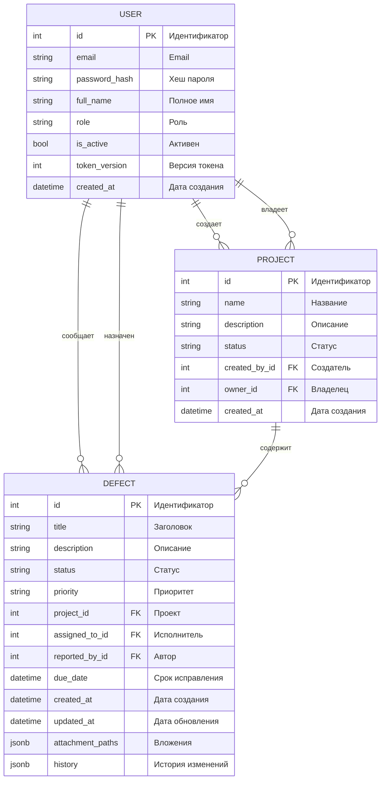

# frame
# DEFECT - Defect management system at construction sites

## 📋 О проекте

DEFECTS - это монолитное веб-приложение для централизованного управления дефектами на строительных объектах. Система обеспечивает полный цикл работы: от регистрации дефекта и назначения исполнителя до контроля статусов и формирования отчётности для руководства.

### 👥 Целевая аудитория

- **Инженеры** - регистрация дефектов, обновление информации
- **Менеджеры** - назначение задач, контроль сроков, формирование отчетов
- **Руководители и заказчики** - просмотр прогресса и аналитической отчетности

## 🏗️ Архитектурный обзор

Проект реализован как монолитное веб-приложение с использованием .NET и Entity Framework. Архитектура разделена на следующие слои:

### 📊 ER-диаграмма базы данных

## 🔐 Безопасность

- **Аутентификация** - JWT tokens с версионированием
- **Хранение паролей** - bcrypt хеширование
- **Ролевая модель** - строгое разграничение прав доступа

## 🛠️ Технологический стек

- **Backend**: Node.js, Entity Framework Core, ASP.NET
- **База данных**: PostgreSQL
- **Аутентификация**: JWT Bearer
- **Безопасность**: bcrypt
